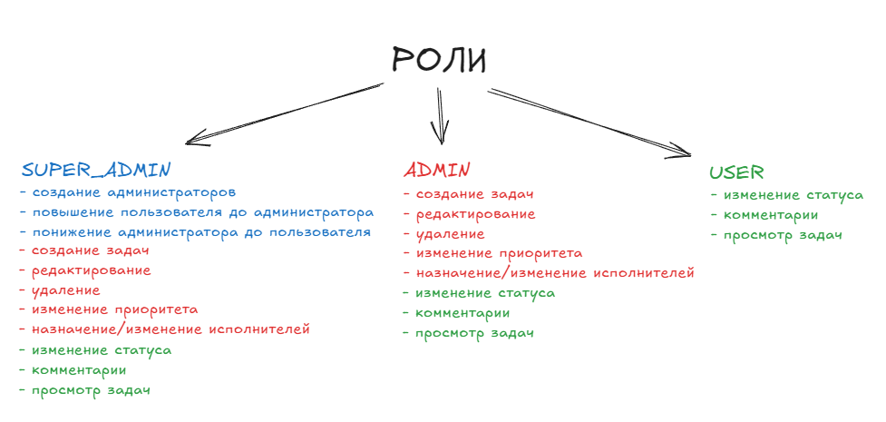

# SIMPLE TASK MANAGER SYSTEM

## Использованные технологии

* [Spring Boot](https://spring.io/projects/spring-boot) – как основной фрэймворк
* [PostgreSQL](https://www.postgresql.org/) – как основная реляционная база данных
* [Liquibase](https://www.liquibase.org/) – для ведения миграций схемы БД
* [Gradle](https://gradle.org/) – как система сборки приложения
* [Swagger UI](https://docs.swagger.io/spec.html) - для автоматического создания документации
* [Docker](https://www.docker.com/) - развертывание среды разработки
* [Testcontainers](https://testcontainers.com/) - запуск интеграционных тестов с изолироваными контейнерами
* [GitHub Actions](https://docs.github.com/ru/actions) - настройка CI для сборки и тестирования

## Локальный запуск

**1. Убедитесь, что у вас установлен Docker и Docker Compose**

Для проверки введите в терминале:
```shell
docker --version
docker-compose --version
```

**2. Перейдите в каталог проекта**

По умолчанию для супер-админа используются следующие параметры
```yaml
- SUPER_ADMIN_EMAIL=super@example.test
- SUPER_ADMIN_PASSWORD=Password1234
- SUPER_ADMIN_USERNAME=super_admin
```
С помощью этих данных можно авторизоваться в системе в качестве супер-администратора 
При необходимости можно заменить параметры на свои в файле [docker-compose](docker-compose.yaml)

**3. Запуск приложения:**
```shell
docker-composer up
```

**3. Остановка приложения**
```shell
docker-compose down
```

## Описание

В данной системе реализована ролевая система которая включает в себя  супер-администратора, администраторов, 
и обычных пользователей. Функциональные возможности каждой роли представлены на рисунке




